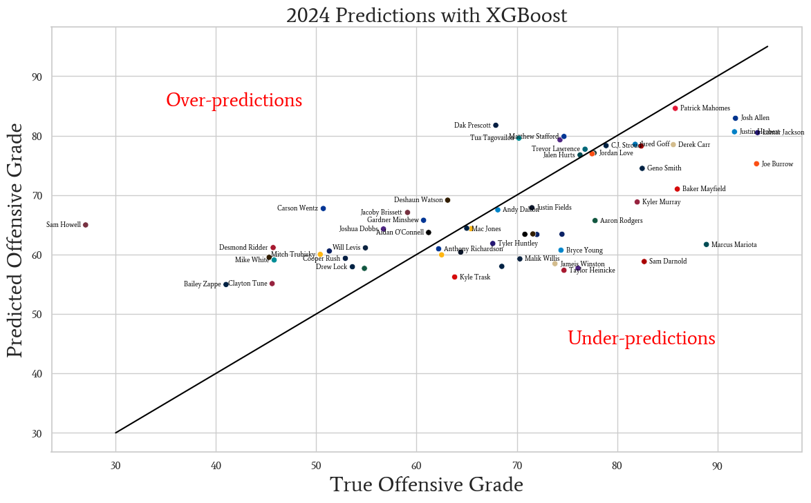
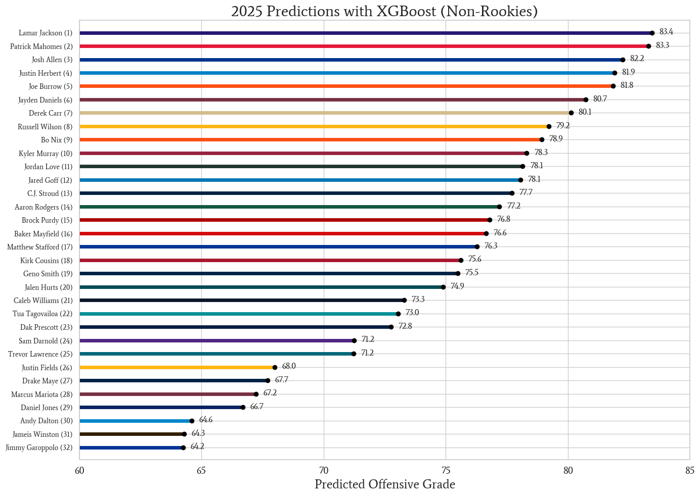

# Goal
How can we measure QB performance? Passing statistics like yards, touchdowns, or completion % are often not indicative of a player's performance. Rating systems (NFL passer rating or ESPN QBR) also have their weaknesses and can be heavily influenced by other players on the field. [Pro Football Focus](https://www.pff.com/)'s offensive grade is an aggregate measure of a QB's overall performance. The goal of this project is to create a predictive model that takes in a QB's past statistics to predict their __PFF offensive grade__ in the next season. 

# Data
- **Source:** Pro Football Focus
- **Records:**
  - 19 seasons (2006–2024)
  - 1,398 QB seasons
  - 299 unique QBs
- **Features:**
  - 61 passing & rushing metrics

# Modeling
## 1. XGBoost
- **Input:** Last season + 5-year & career summary stats  
- **Tuning:** Bayesian optimization  
- **Validation:** 5‑fold K‑Fold  
- **Validation RMSE:** 12.22

## 2. RNN
- **Input:** Full chronological sequence of past seasons  
- **Split:** 80% train / 20% validation  
- **Validation RMSE:** 14.74

> **Note:** XGBoost outperformed the RNN and is used for final predictions.

# Results
The model was then trained on the 2006–2022 data, using the 2023 data as a holdout test set to predict 2024 grades:



Each point represents a single player in 2024. The distance from the black line is how far off our prediction was. A perfect model would only have dots on the line. The model finished with a **RMSE of 11.49** and a **R² of 0.36**.

---

Finally, the model was trained on all data (2006-2023), using the 2024 data to predict 2025 grades:




# Files

- eda.ipynb - Data cleaning, EDA, and feature engineering.
- xgboost.ipynb - Bayesian optimize XGBoost model and predict on both 2024 and 2025 seasons.
- rnn.ipynb - Train and validate a RNN.
- helper.py - Custom functions for data processing, visualization, and model training.
- presentation.pdf - Slide deck to summarize findings.

# Repository Structure
```
├── eda.ipynb
├── xgboost.ipynb
├── rnn.ipynb
├── helper.py
├── README.md
├── presentation.pdf
└── images/
    ├── slide_1.PNG
    ├── xgboost_2024_preds.PNG
    └── xgboost_2025_preds.PNG
```
