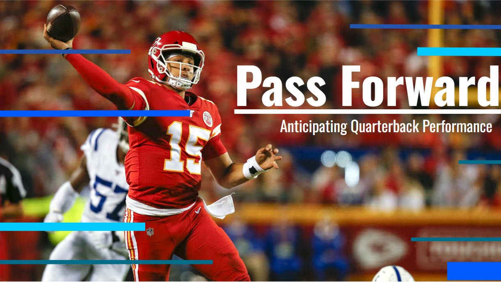
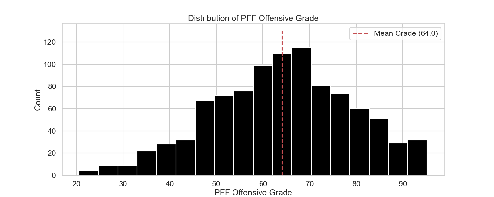
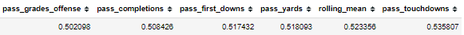
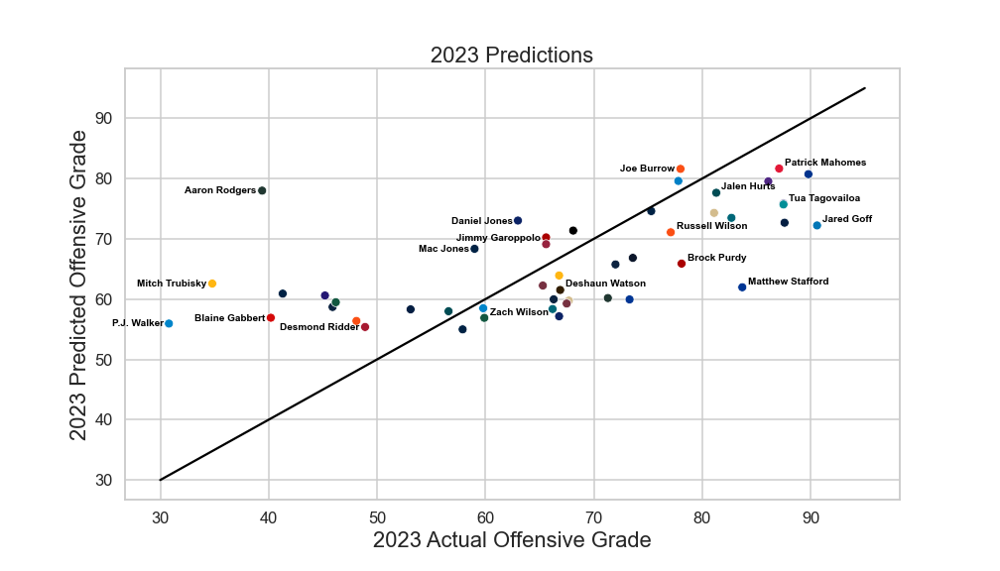

# Pass Forward
Welcome to __Pass Forward__, where we aim to anticipate quarterback performance!

## Business Problem
In the game of football, he most important position on the field is the quarterback position. Accurately predicting QB performance can give NFL organizations insight on how to assess their own QB, as well as assessing other QBs around the league (say for potential trade opportunities). These predictions also have obvious applications in the realm of sports betting and fantasy football.

So, how can we measure QB performance? Passing statistics, like yards, touchdowns, or completion percentage are often not indicative of a player's performance. Rating systems like NFL passer rating or ESPN's QBR also have their weaknesses, and can be heavily influenced by other players on the field (namely the offensive line or wide receiver corps).

In this project, the metric used to measure QB performance was __Pro Football Focus' Offensive Grade__. PFF is an analytics organization that works with all 32 NFL teams to provide data-driven insights. Their database contains a trove of advanced statistics and measurements used to capture a player's complete performance. "Grade" was chosen as the target, as it rewards players for their true performance, regardless of the play's outcome. It is widely considered the best metric to assess player performance in the NFL. 

With that, the goal of this project was to __predict 2023 QB offensive grade__ with maximum accuracy.

## Data
The data used in this project was completely sourced from [pff.com](pff.com). The dataset contained 1306 QB seasons of 288 unique NFL QBs, extracted from the 2006-2023 NFL seasons. Postseason data was exluded, as it introduces inconsistency in the volume for each player. This included backup QBs who only played a single game during the season, to QBs who played all 16 or 17 games during the year. The data contained 61 numerical passing and rushing statistics that were used to train the predictive models. 

The data was formatted in such that a single row represented a single season from a specific QB. For example, Patrick Mahomes had 7 rows in the dataset, as he has played in 7 different seasons.

Here is the distribution of the target variable:

The average offensive grade in the dataset was 64, with a standard deviation of about 15.

The full data intake & combination process can be found in [this notebook](./data_formatting.ipynb).

## Analysis
### Engineered Features
I engineered 5 new features in total. I first created two normalized metrics: __pass TDs per game__ and __pass yards per game__. I hoped that these metrics would capture how well a QB did on a game-by-game basis rather than the total statistics for these 2 categories. I also created an __experience__ feature to record the amount of seasons the QB had played in the league. Finally, I engineered two more metrics: __rolling mean__ and __rolling standard deviation__ of offensive grade. These two features were calculated by looking at a QB's current season offensive grade, and up to 2 previous seasons (taking 3 most recent seasons). I hoped that this would capture a QB's performance and consistency in his recent career. Rolling mean ended up having the second-highest correlation of all features, as shown below.

### Correlation
Very few features had strong correlations with the target. To be exact, only 6 had a correlation of 0.5 or higher. Here are those correlations:


More in-depth analysis of feature correlation can be found in [this notebook](./feature_analysis.ipynb).

## Models
Of the 1306 QB seasons, 288 had to be dropped, as they had no target variable (players in their final season and 2023 rookies). This left 1018 QB seasons. The 48 from the 2022 season were set aside as a final holdout set, leaving 970 rows in the training set. Models were iteratively trained using 5-fold cross validation. 

I tested 7 total machine learning algorithms. I used the statistics of a QB in season __x__ to predict their offensive grade in season __x+1__. I used many models from the [scikit-learn](https://scikit-learn.org/stable/) library as well as [XGBoost](https://xgboost.readthedocs.io/en/stable/). These models can be found in [this notebook](./models_1).

The best performing algorithm ended up being a __RandomForestRegressor with min_samples_split=112__. It had an average __validation RMSE of 12.17__ and a __validation R-Squared of 0.33__.

## 2023 Predictions
Since 10 out of 18 of the 2023 NFL weeks have already been played, we can actually see how well our final predictions have done thus far through the season. Here is a visualization of our final model's predictions:

Each point represents a single player in 2023. The distance from the black line is how far off our prediction was. Ideally, a perfect model would only have dots on the line. Dots above the line are cases in which our model overpredicted the player's performance, and dots below the line are under-predictions.

Using these first 10 weeks of 2023, our RMSE was __12.16__ and R-Squared was __0.40__. You can see in the graph above, Aaron Rodgers was by far our worst prediction. with an error of 38.6. It should be noted that he was injured on the 4th play of the 2023 season with a torn achilles, so this point is clearly an outlier. If we drop this point, our RMSE goes from a 12.16 to a __10.92__, and R^2 leaps from a 0.4 to a __0.49__.

## Next Steps
Once the 2023 season is complete, I can re-evaluate the model's performance on the full season. Stay tuned for 2024 predictions!

## More Information
For additional info or any questions, you can contact me at heefjones9@gmail.com.

## Repository Structure

```
├── images
├── models
│   ├── models.csv
├── train_data
│   ├── data.csv

├── .gitignore
├── README.md
├── data_formatting.ipynb
├── feature_analysis.ipynb
├── models_1.ipynb
└── presentation.pdf
```
